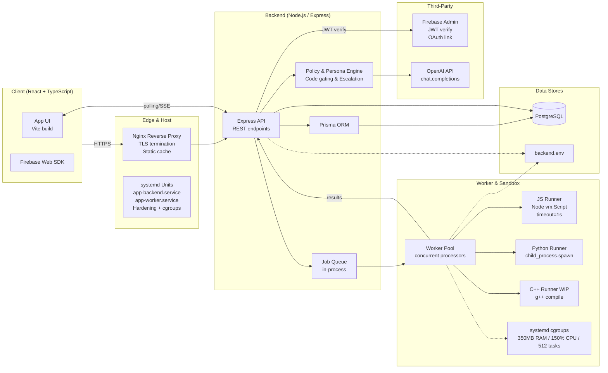
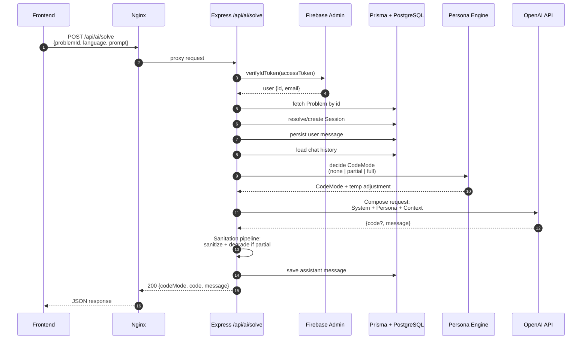
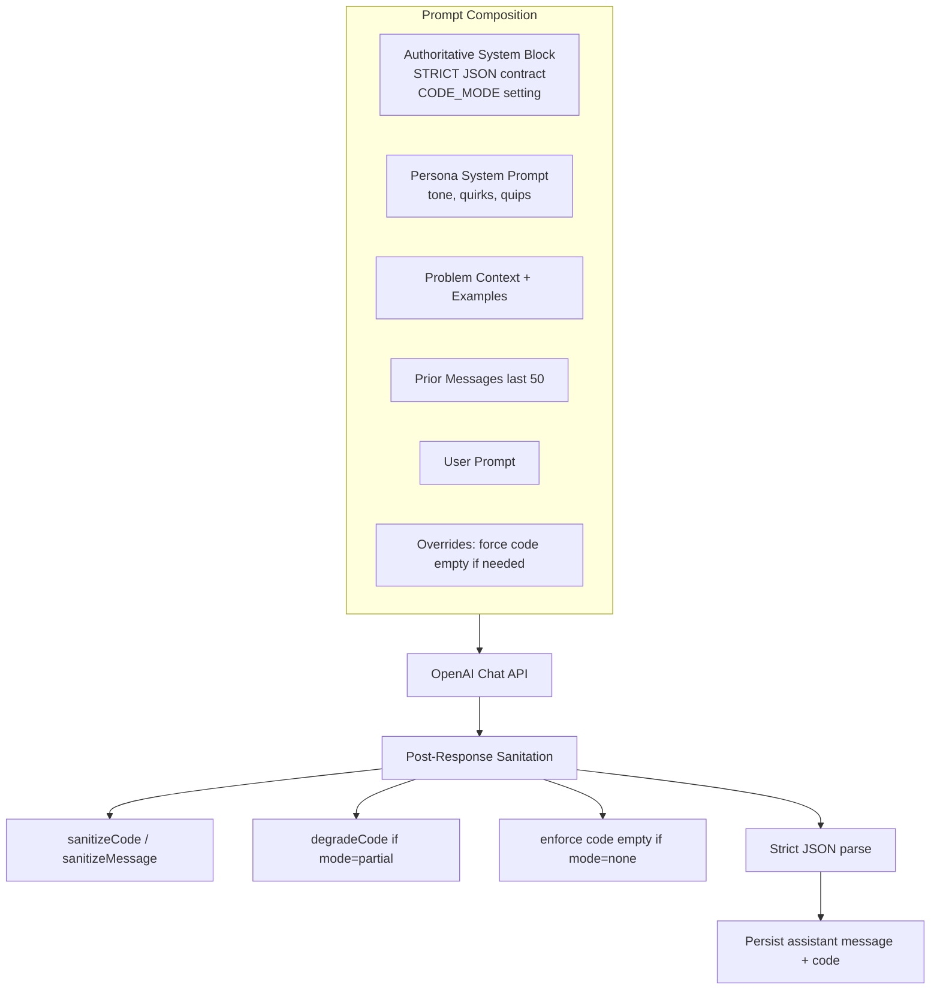
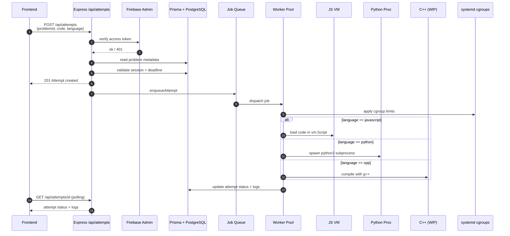
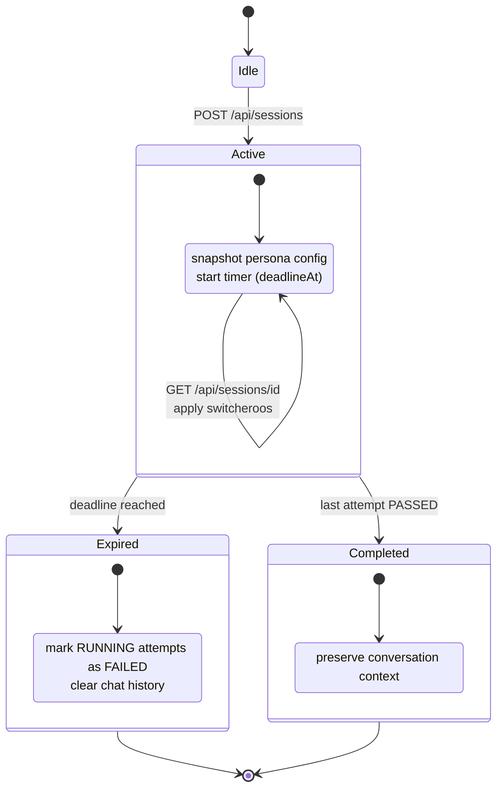
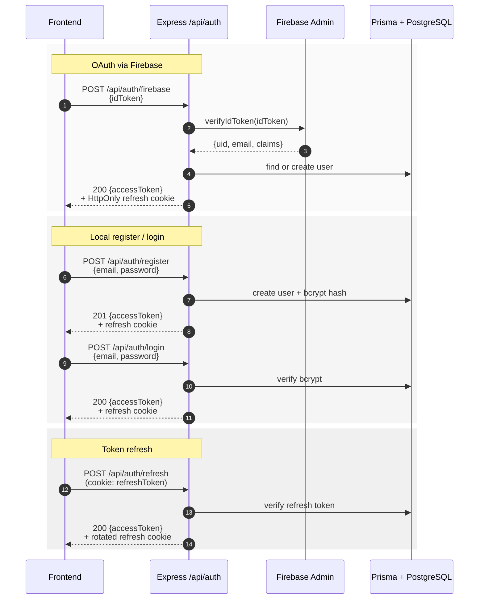

# Agile Hostile - toxic pair programming simulator


---

##  Concept
Welcome to the world's most accurate corporate simulator: you're a developer forced into pair-programming with unhinged AI personalities who gaslight, procrastinate, and occasionally produce working code by accident.

Instead of solving problems directly, you get **tickets**.  The editor is **locked**. You talk to a rotating cast of **AI coworkers**; each with their own egos and failure modes. Your job is to manipulate them into solving problems before your timer runs out.

---

##  Technical Architecture

### Stack Overview

| Layer | Technologies |
|-------|-------------|
| **Frontend** | Vite + React + TypeScript |
| **Backend** | Express + Prisma + PostgreSQL |
| **Auth** | Firebase JWT |
| **Infrastructure** | Nginx + systemd + AWS Lightsail |

**Request Flow:**
```
Nginx → Express → Prisma → PostgreSQL
```

**Key Features**
- Stateless REST API with Firebase JWT authentication  
- Resource-based routes: `/problems`, `/attempts`, `/sessions`, `/personas`
- Worker-based sandbox for code execution (per-language subprocesses)
- Persona-based AI simulation engine
- Timed sessions with dynamic "switcheroos"

---

## Core Components
### System architecture


### Request Sequence: AI persona gating

#### Persona Escalation Logic
The system dynamically adjusts code availability based on conversation context:

| Input | Description |
|-------|-------------|
| **Assistant turns** | Number of AI replies so far |
| **User pressure** | Count of "write code / implement" prompts |
| **Persona policy** | Config thresholds for unlocking code |
| **Defense score** | (Optional) User's algorithm justification |

Simplified pseudocode:
```
if (writeCodeByDefault) mode = "full"
else if (turns < partialAfterTurns) mode = "none"
else if (pressure >= partialAfterPressure) mode = "partial"
else if (turns >= fullAfterTurns && pressure >= fullAfterPressure) mode = "full"
```

Prompt Composition Pipeline:


## Sandboxed code execution

### Worker-based Isolated Runners

- Node.js VM for JavaScript (timeout: 1s)
- Python via child_process.spawn 
- C++ (WIP) compilation via g++

#### System Limits (cgroups):
- RAM: 350MB
- CPU: 150%
- PIDs: 512 max

**System limits (cgroups):**

Hosted on AWS Lightsail, managed with systemd services:

Service	Role
app-backend.service	API server
app-worker.service	Code grader queue

Hardening:
NoNewPrivileges, read-only filesystem, CPU/RAM cgroups.


## Session lifecycle


## Authentication flow (jwt, oauth)

## Persona system
Each AI coworker has:

- Personality traits (procrastinator, perfectionist, gaslighter)
- Code gating policy (when they'll actually write code)
- Escalation thresholds (how much pressure before they cave)
- Custom prompt engineering (their unique voice/behavior)

## some API Routes
### Authentication
- `POST /api/auth/register` - Create new user account
- `POST /api/auth/login` - Email/password login
- `POST /api/auth/firebase` - OAuth via Firebase
- `POST /api/auth/refresh` - Refresh access token

### Problems & Sessions
- `GET /api/problems` - List available problems
- `GET /api/problems/:id` - Get problem details
- `POST /api/sessions` - Start new problem session
- `GET /api/sessions/:id` - Get session status
- `POST /api/sessions/:id/complete` - Mark session complete
- `POST /api/sessions/:id/expire` - Expire session

### AI Interaction
- `POST /api/ai/solve` - Chat with AI persona
- `GET /api/personas` - List available personas

### Code Execution
- `POST /api/attempts` - Submit code for grading
- `GET /api/attempts/:id` - Get attempt results

---


### Environment variables 
These are held as GitHub secrets, no API key was pushed to prod :)

 

